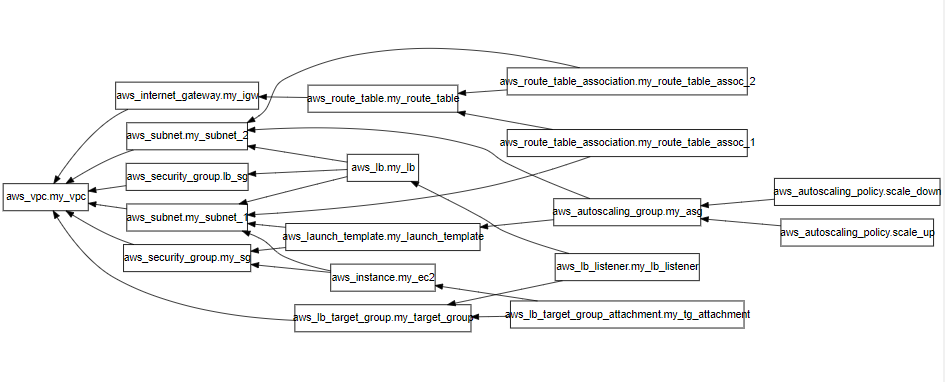

# Auto-Scale-EC2-LoadBalancer

## Overview

This project sets up a highly available and scalable infrastructure using AWS services with Terraform. It includes an auto-scaling EC2 instance setup behind an Application Load Balancer (ALB). The infrastructure is designed for fault tolerance across multiple Availability Zones (AZs) and includes automated scaling policies based on load.

---

---

### Key Features:

- **Virtual Private Cloud (VPC):** A custom VPC with two public subnets across multiple Availability Zones, allowing for high availability.
- **EC2 Instances:** Automatically scaled EC2 instances using an Auto Scaling Group (ASG), ensuring elasticity based on load.
- **Application Load Balancer (ALB):** Distributes incoming traffic across EC2 instances in different Availability Zones for improved fault tolerance.
- **Auto Scaling Policies:** Automated policies for scaling the number of instances up and down, based on traffic and resource utilization.
- **Security Groups:** Properly configured security groups for EC2 instances and the ALB to ensure secure access over specific ports.
- **Modular Design:** Terraform configurations are organized into modular files for easy management and scalability.

### Project Structure:

- **main.tf:** Main file that configures the provider and integrates all resources.
- **vpc.tf:** Defines the VPC, subnets, internet gateway, and routing.
- **security_groups.tf:** Manages security groups for the EC2 instances and the ALB.
- **ec2.tf:** Sets up EC2 instances with appropriate configurations.
- **load_balancer.tf:** Configures the Application Load Balancer, its target group, and listeners.
- **autoscaling.tf:** Creates an Auto Scaling Group (ASG) and scaling policies.
- **variables.tf:** Contains input variables for flexibility and reusability.
- **outputs.tf:** Defines the key output values like EC2 public IP and ALB DNS.
- **terraform.tfvars:** Variable values that are specific to the environment.

### How to Use:

1. **Install Terraform**: Make sure Terraform is installed on your local machine.
2. **AWS Credentials**: Configure your AWS credentials (using `aws configure` or setting up environment variables).
3. **Initialize Terraform**: Run `terraform init` to initialize the working directory.
4. **Apply the Configuration**: Execute `terraform apply` to provision the infrastructure. Confirm the changes when prompted.
5. **Outputs**: Once applied, the EC2 instance's public IP and ALB DNS name will be displayed.

### Scalability and High Availability:

This setup is built for scaling EC2 instances dynamically to handle varying traffic levels, ensuring that the system remains resilient under load. With the inclusion of multiple subnets across Availability Zones, it also guarantees high availability for applications.

### Prerequisites:

- AWS Account
- Terraform CLI installed
- Basic knowledge of Terraform and AWS services
